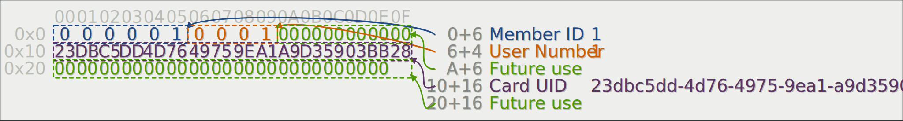

# Format

## Sector 0

Sector 0 is mainly controlled by the Mifare Classic chip and contains the
Mifare Application Directory (MAD).

## Sector 1

Sector 1 is used by VAT only.

To be checked: Other users can use other sectors, as defined by the MAD in sector 0. But for now,
VAT is expected to be present in sector 1.

### Data

Rendered with: http://corkami.github.io/sbud/hexii.html

```
hexii: [
    "000001", "0001", 0, 0, 0, 0, 0, 0,
    35, 219, 197, 221, 77, 118, 73, 117, 158, 161, 169, 211, 89, 3, 187, 40,
    0, 0, 0, 0, 0, 0, 0, 0, 0, 0, 0, 0, 0, 0, 0,
],
descriptions: [
    [6, "Member ID", "1"],
    [4, "User Number", "1"],
    [6, "Future use", ""],
    [16, "Card UID", "23dbc5dd-4d76-4975-9ea1-a9d35903bb28"],
    [16, "Future use", ""],
],
```



### Access control

**Key A:** read-only, used by card reader
**Key B:** read-write, used by provisioning application (android app)

```
Block0: C1=1, C2=0, C3=0: read: A, B - write: B
Block1: C1=1, C2=0, C3=0: read: A, B - write: B
Block2: C1=0, C2=0, C3=0: read: A, B - write: A, B

Block3: C1=0, C2=1, C3=1: write key A: B, write key B: B, write access bits: B
# Block3: C1=1, C2=0, C3=0: write key A: B, write key B: B
```